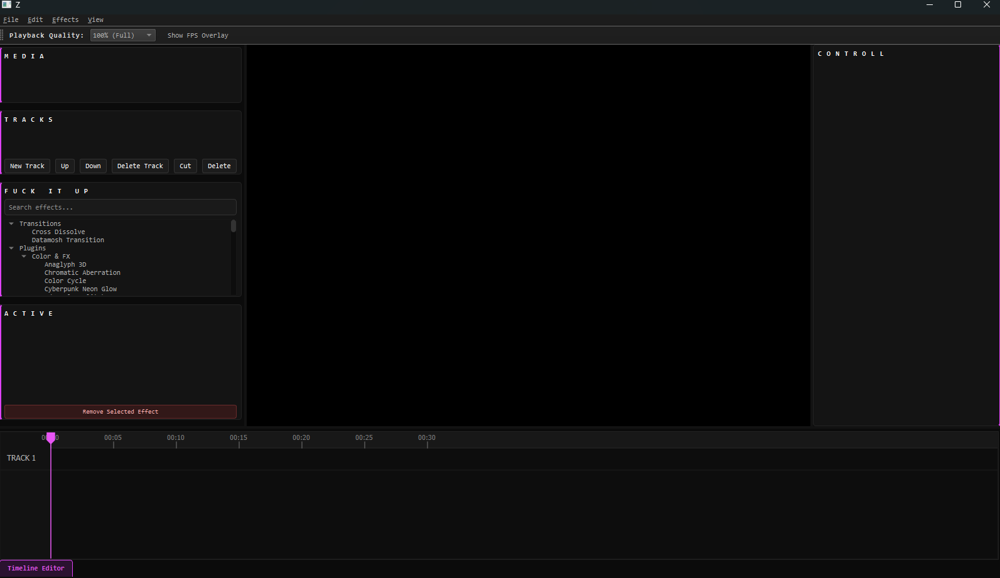

# Z

Z is an open-source video editor built for creating datamoshing effects. It's written in C++ and uses GLSL shaders for real-time GPU-accelerated effects.

## Features

- Real-time datamoshing with support for P-frame dropping, I-frame dropping, and other compression-based effects.
- Experimental video effects, including XOR-based distortion and other glitch-inspired visuals.
- Shader-based plugin system. Write a GLSL fragment shader, drop it into the plugins folder, and see the effect instantly.
- Built entirely in C++ using open-source libraries such as FFmpeg.

## UI

## DEMO

to be added ltr

## PLUGINS

Please read the docs on how to write shader plugins over [here](https://z.codezey.dev/docs/shader_plugin_guide.html)

## Roadmap

Priority: 
- Fix Transitions (currently unusable and unstable asf)
- Timeline improvements

Later: 
- Better Audio reactive effects
- GPU & CPU performance optimizations
- BETTER UI (🙏🙏🙏)
- Fix minor bugs and crashes.
- linux and mac comptabilty?
- and more..?