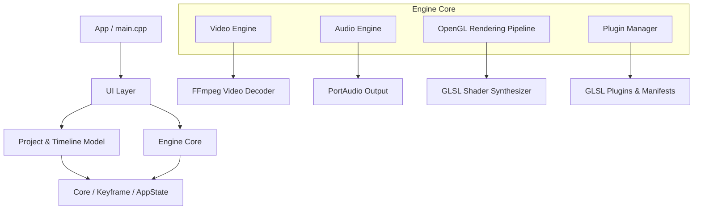

# Z System Architecture & Design

## 1. High-Level Architecture
**Z** is a high-performance native desktop creative application built with C++20, Qt6, and modern OpenGL for datamoshing, GLSL shader synthesis, and experimental video editing.

---

## 2. Subsystem Ownership & Separation of Concerns

### `app/`
- **Responsibilities**: Application entrypoint (`main.cpp`), global Fusion dark palette, application-level stylesheet definitions, Qt high-DPI initialization.

### `core/`
- **Responsibilities**: Foundation utilities (`logging.h`), animation curve and keyframe evaluation with cubic Hermite tangents (`keyframe.h`, `keyframe.cpp`), undo/redo history management (`appstate.h`, `appstate.cpp`).
- **Invariants**: `Core` has zero dependencies on high-level UI or media decoding.

### `project/`
- **Responsibilities**: Multi-track timeline state (`TimelineTrack`), clip references (`ProjectClip`), transitions (`ProjectTransition`), and JSON project serialization (`project.h`, `project.cpp`).

### `engine/`
- **`video/`**: FFmpeg demuxing and multi-threaded decoding (`videodecoder.cpp`), asynchronous frame caching and prefetching (`videoengine.cpp`).
- **`audio/`**: PortAudio audio engine, atomic thread synchronization, live volume meters, and playback sync (`audioengine.cpp`).
- **`rendering/`**: OpenGL 3.3 Core Profile widget (`glwidget.cpp`), multi-pass FBO ping-pong feedback loop for glitch/datamosh effects, HUD overlay.
- **`effects/`**: Bitwise CPU operators XOR, AND, OR, XNOR, NAND (`cpueffects.cpp`).

### `plugins/`
- **Responsibilities**: Dynamic shader plugin loading (`pluginmanager.cpp`), parameter reflection from JSON manifests, and runtime hot-reloading.

### `ui/`
- **Responsibilities**: Main window layout, dock widgets (`mainwindow_docks.cpp`), inspector panel (`inspector.cpp`), interactive timeline (`timeline.cpp`), effects library (`effectsbrowser.cpp`), media pool (`mediapool.cpp`), and settings dialog (`preferencesdialog.cpp`).

---

## 3. Playback & Synchronization Flow
1. `AudioEngine` drives the master high-precision audio clock via PortAudio callback.
2. In the Qt UI thread, `playbackTimer` queries `AudioEngine::instance().getPlayheadTime()`.
3. `VideoEngine` fetches or interpolates the decoded video frame at time `t`.
4. `GLWidget` binds the video frame texture, compiles/binds the active shader stack, updates uniforms (`u_time`, `u_resolution`, parameters), and paints the framebuffer.
